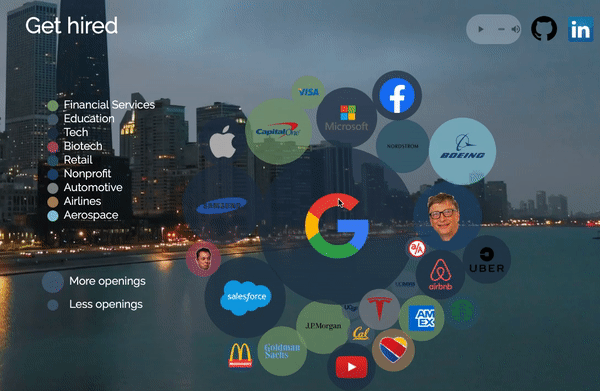

# Jobubbles

Jobubbles is a data visualization of the current job openings of large companies displayed with interactive bubbles.

&nbsp;

### Click for Live Demo
[](https://noelseo.github.io/Jobubbles/)

<!-- [Live Demo](https://noelseo.github.io/Jobubbles/) -->

&nbsp;


## Technologies
* `JavaScript` for Framework
* `HTML` and `CSS`
* `Indeed API` for Data Retrieval
* `D3.js` for Data Visualization

## Features and MVPs

### Bubbles and Legends Generating Different Colors Based on Company Industry
* Bubbles and Legends are created with different colors with the D3.js's scaleOrdinal method

```javascript
    let scaleColor = d3.scaleOrdinal([`#789c6e`, `#4c5f72`, `#1e3349`, `#a64960`, `#29586c`, `#1d456d`, `#85888b`, `#a9845c`, `#89c7d6`]) 

    Legend(scaleColor, svg);

    function Legend(scaleColor, svg) {
        let legendOrdinal = d3
            .legendColor()
            .scale(scaleColor)
            .shape("circle");
    }
```

```javascript
    node
        .append("circle")
        .attr("id", d => d.id)
        .attr("r", 0)
        .style("fill", d => scaleColor(d.cat))
        .style("opacity", 0.7)
        .transition()
        .duration(300)
        .tween("circleIn", d => {
            let i = d3.interpolateNumber(0, d.radius);
            return t => {
                d.r = i(t);
                simulation.force("collide", d3.forceCollide(d => d.r));
            };
        });
```

### Bubble Movements
* When clicking on bubbles, they will expand to the size based on the number of the openings



* Bubbles are draggable and can be rearranged


```javascript
    let simulation = d3
        .forceSimulation()
        .force("charge", d3.forceManyBody())
        .force("collide", d3.forceCollide(d => d.r))
        .force("x", d3.forceX(centerX))
        .force("y", d3.forceY(centerY));

    let node = svg
        .selectAll(".node")
        .data(nodes)
        .enter()
        .append("g")
        .attr("class", "node")
        .call(
            d3
                .drag()
                .on("start", d => {
                    if (!d3.event.active) simulation.alphaTarget(0.2).restart();
                    d.fx = d.x;
                    d.fy = d.y;
                })
                .on("drag", d => {
                    d.fx = d3.event.x;
                    d.fy = d3.event.y;
                })
                .on("end", d => {
                    if (!d3.event.active) simulation.alphaTarget(0);
                    d.fx = null;
                    d.fy = null;
                })
    );
```

### Links to Company's Careers Site
* Each company bubble provides a direct link to its careers site


```javascript
    infoBox
        .append("a")
        .classed("circle-overlay__bottom", true)
        .html(d => d.link)
        .attr('href', d => d.linkUrl);
```


## Future Plans
* Get API approval from Indeed and implement the actual data [Indeed Job Api](https://opensource.indeedeng.io/api-documentation/docs/get-job/)
* Create mobile friendly responsive UI
